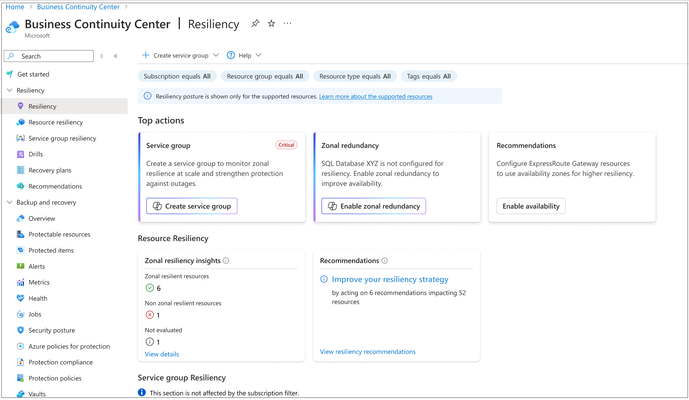
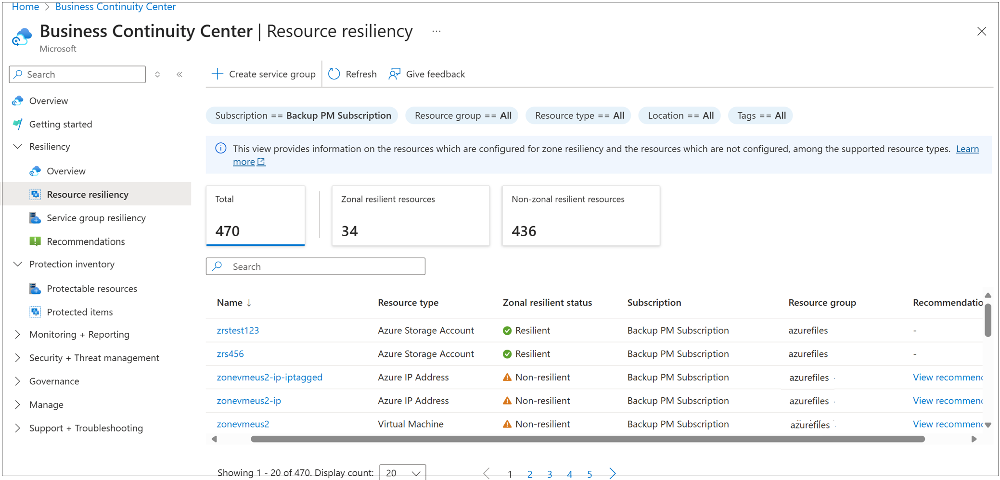
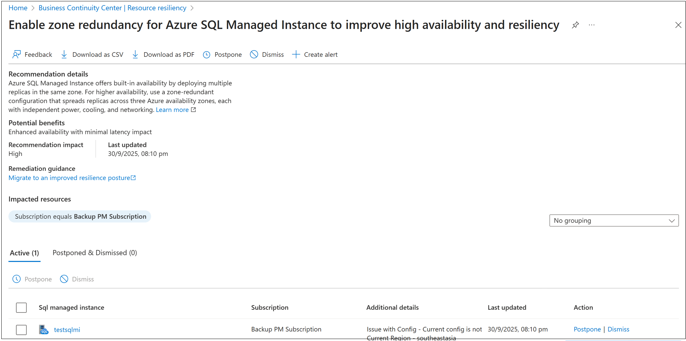
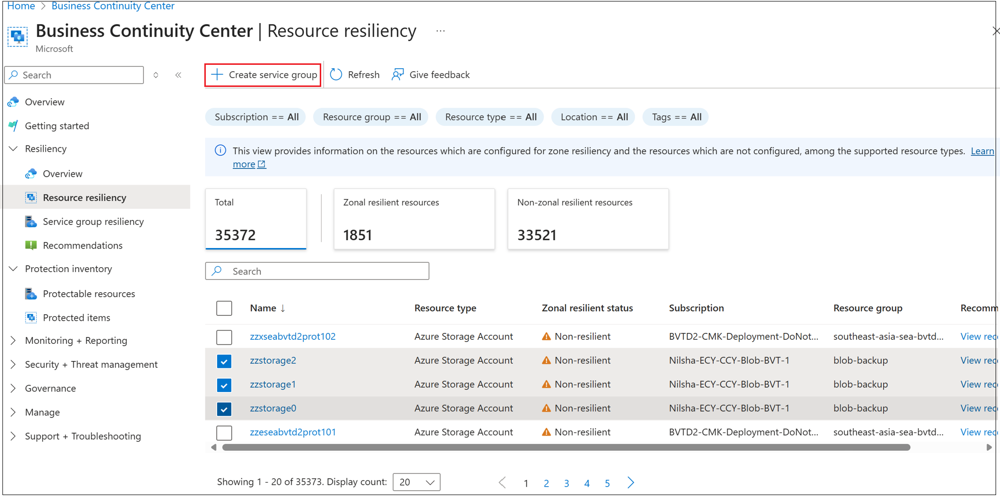
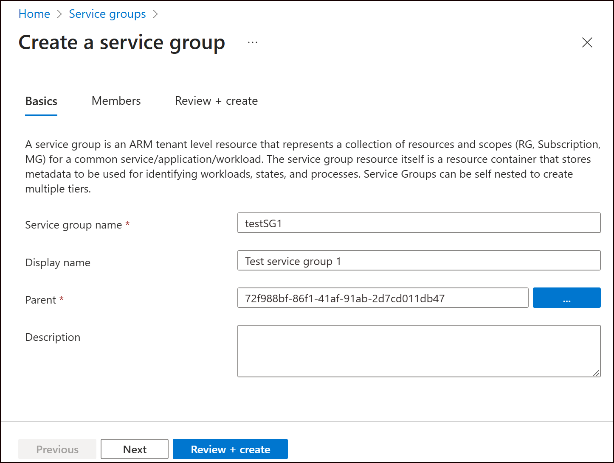
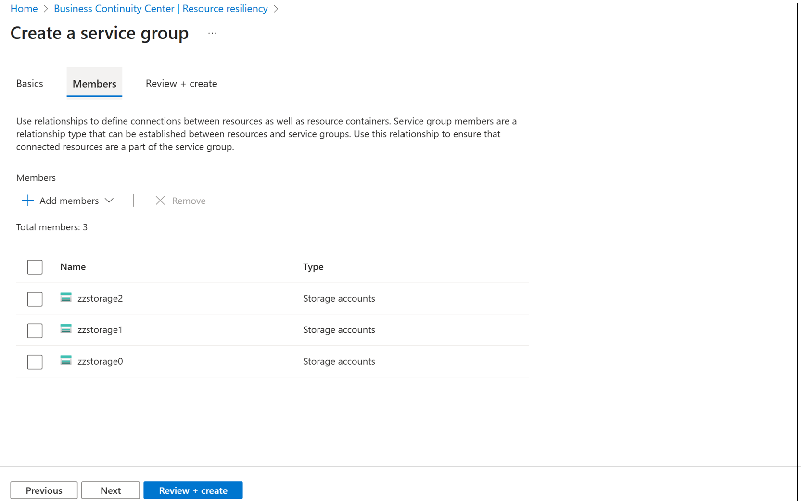
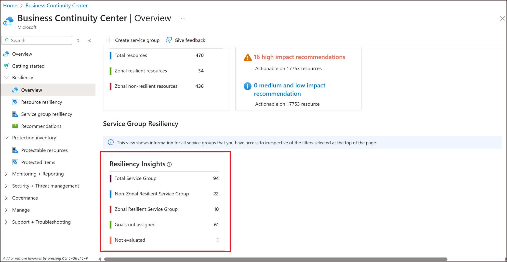
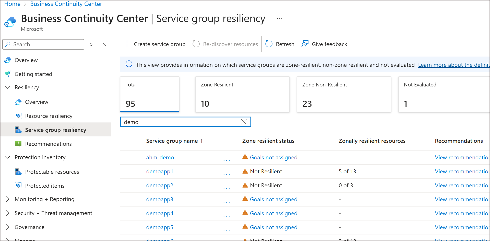

# View resiliency posture across your resources and service groups

You can use at-scale views to get comprehensive visibility into resiliency gaps across your Azure estate. Use the Resiliency section under Resiliency Center (currently displayed as 'Business Continuity center' in the portal) to see a summary of your zone resiliency posture and associated recommendations.
    

Both views support resource-level and service group-level perspectives. If you haven't created service groups yet, you can use the resource-level views to get a summary. Service group creation is recommended for scenarios where you want to:

- View which applications are resilient and which aren't
- Have more granular requirements around which resources belong to an application
- Scope out non-critical resources from resiliency evaluation.

## Resource-level resiliency management

To view which resources are resilient and non-resilient to zone outages, follow these steps:

1. Navigate to the **Resiliency Overview**. You can find this under the Resiliency left navigation in Business Continuity center.

    

2. Under the **Resource resiliency** section, you can see a count of resources that are zone resilient and non-zone resilient among the supported resource types:
   - **Zone resilient resources**: Resources that have been configured with a zone resiliency solution
   - **Non-zone resilient resources**: Resources for which the system didn't detect the configuration of a zone resilient resource

3. Select the tile to view individual resources and their associated zone resiliency status.

    
4. Use the **View Recommendation** option for non-resilient resources to view the Advisor recommendation that has been generated for that resource to make it zone resilient.

    

> [!TIP]
> If you want a view more tailored to your scenario that ensures non-critical resources aren't flagged, and allows you to manually attest resources that are made zone resilient via a custom setup, we recommend creating service groups. You can create service groups directly from Resiliency center. The steps are provided in the next section.

## Create a service group

To create a service group from within the resource resiliency experiences, follow these steps:

1. Navigate to the **Resource resiliency** view under Resiliency center.

    

2. Apply filters as needed and select the resources that you want to group into an application. Select **Create Service group**.

    

3. Enter the name of the service group and the parent under which it should be created.

    

4. In the next screen, you'll see the list of selected resources pre-populated. Review and proceed.

    

5. Once the service group is created, you can see it appear in the Service Group level Resiliency summary. You need to assign goals to the service group for the zone resiliency evaluation to be completed.

## Service group-level resiliency management

Once you've created the required service groups and assigned goals, you can view the resiliency summary across service groups. Follow these steps:

1. Navigate to the **Service group resiliency overview** under Resiliency Center.
2. You'll see the following counts:

   - **Zone resilient service groups**: Service groups where all resources (that aren't excluded) are configured with zone resiliency or manually attested by the user.
   - **Non-zone resilient service groups**: Service groups where one or more resources aren't configured for zone resiliency.
   - **Goals not assigned**: Service groups where goals are not assigned yet.
   - **Not evaluated service groups**: Service groups where one or more resources aren't supported by Resiliency center and couldn't be evaluated. If there's a mixture of non-resilient and non-supported resources in the service group, the service group gets marked as non-resilient directly.
   
3. Select the tile to go to a list view of service groups where you can view the number of resources per service group that are zone resilient. Navigate to the service group to view more detailed information about that service group, and to [include or exclude resources](../Goals%20and%20recommendations/ViewResiliencePosture.md#scenario-1-exclude-non-critical-resources), [manually attest resources](../Goals%20and%20recommendations/ViewResiliencePosture.md#scenario-2-manually-attest-resources), and [review recommendations](../Goals%20and%20recommendations/Recommendations.md) generated for that service group.

    

> [!IMPORTANT]
> If a non-resilient resource in a service group is manually attested by the user, it appears as resilient in the service group view, but still appears as non-resilient in the resource-level resiliency view. This issue will be addressed in future releases.
