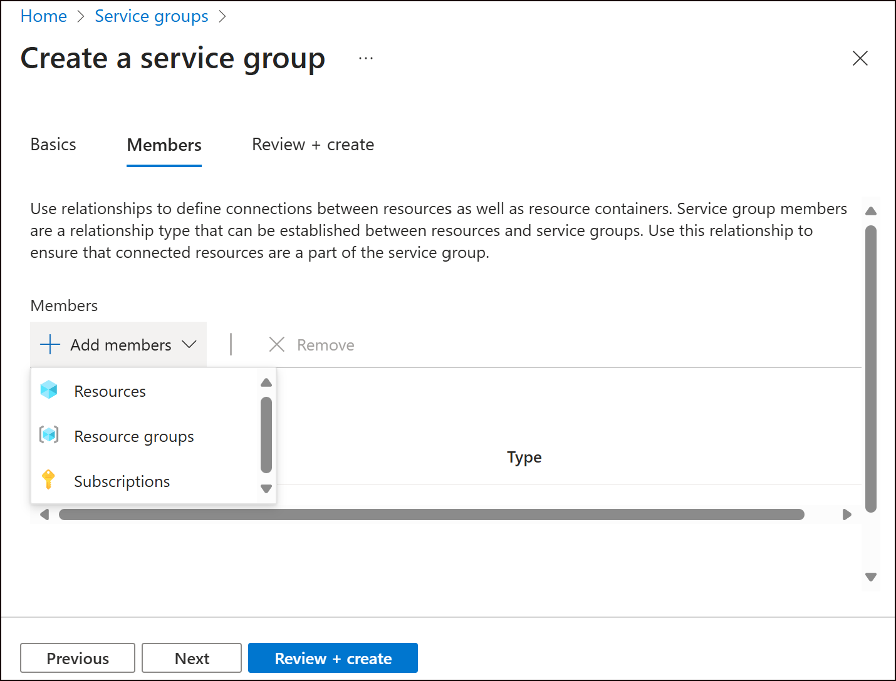
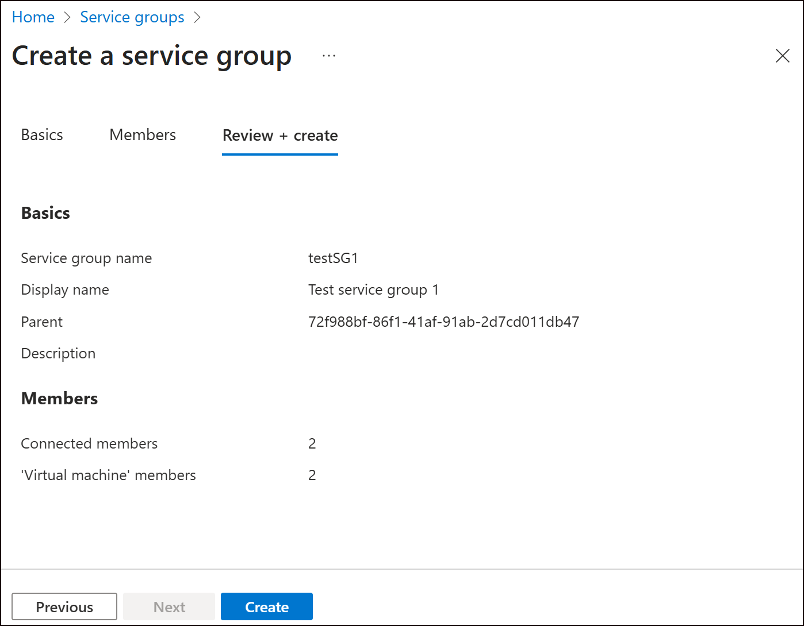
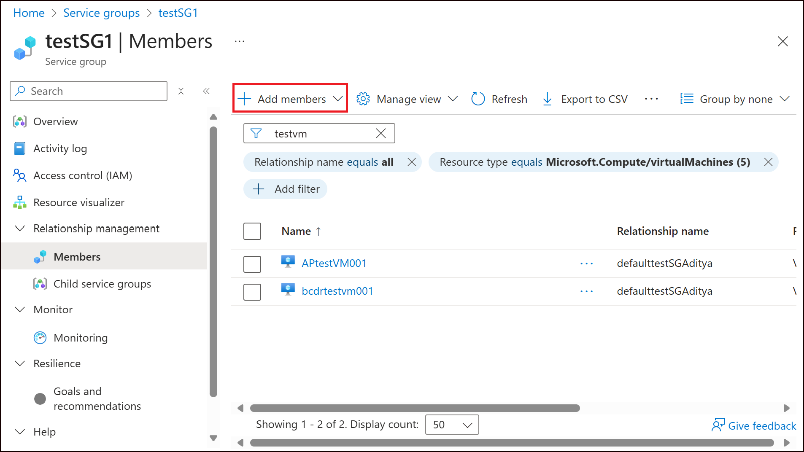
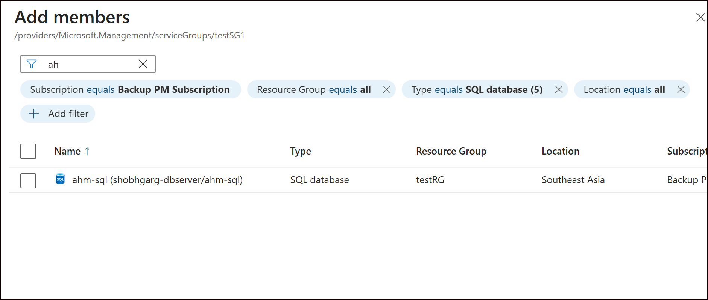

# Create a service group

Azure Service Groups offer a flexible way to organize and manage resources across subscriptions and resource groups, parallel to any existing Azure resource hierarchy. They're ideal for scenarios requiring cross-boundary grouping, minimal permissions, and aggregations of data across resources. These features empower teams to create tailored resource collections that align with operational, organizational, or persona-based needs.

## Overview

Key capabilities of service groups include:

- **Multiple hierarchies**: Service Groups enable scenarios where resources can be grouped in different views for multiple purposes. The same resources can be connected to many different service groups, allowing different customer personas and scenarios to be created and used. You can create many different views that support how you organize your resources.

- **Flexible membership**: Service Groups allow resources from different subscriptions to be grouped together, providing a unified view and management capabilities.

- **Low privilege management**: Service Groups are designed to operate with minimal permissions, ensuring that users can manage resources without needing excessive access rights.

> [!TIP]
> For more information about Service Groups, see [Service Groups overview](https://learn.microsoft.com/azure/governance/service-groups/overview).

## Create a service group to model your application

To create a service group in the Azure portal:

1. Sign in to the [Azure portal](https://portal.azure.com).

2. In the search bar, search for **Service Groups**.

3. Select **+ Add Service Group** to start creating a new group.

4. On the **Basics** tab, provide the required information:

   - **Service Group ID**: Enter a unique identifier for your service group. This ID is used for all commands and references to the group within Azure and can't be changed after creation.

   - **Display Name**: Optionally, enter a display name for the service group. This name appears in the Azure portal and can be updated at any time.

   - **Parent Service Group**: Select the parent service group.

> [!NOTE]
> The root service group is automatically created using the Microsoft Entra ID as its identifier. If you're unsure which parent to select, choose the **Root Service Group**. This group's ID matches your tenant's ID, in the format `Microsoft.Management/serviceGroups[tenantId]`.

5. Select **Next** to proceed.

6. On the **Members** tab, add the initial set of resources that should be part of your service group. You can select individual resources or a subscription/resource group.

    

7. On the **Review + create** tab, review your settings, then select **Create** to finalize the service group.

    

## Add members to an existing service group

You can add more member resources to the service group after creation.

### Prerequisites

To add members, you must have:

- `Microsoft.Relationship/ServiceGroupMember/write` permission on the source resource
- `Microsoft.ServiceGroup Contributor` role on the target service group

### Add resources to a service group

1. Navigate to the service group you created and select the **Members** tab.

    

2. Select **Add members**, then choose the **Resources** option. The resource selection pane opens.

    

3. Use filters (such as subscription, resource group, tags, or resource types) to find and select the relevant resources.

    

4. After selecting the required resources, submit your selection. You can monitor the addition process through notifications, and the newly added members appear on the **Members** page.

## Next steps

- [Assign goals to service group](./Goals%20and%20recommendations/AssignGoals.md)
