# Tutorial: Define and Execute a Zone Down Drill to Assess Service Group Resiliency

## Introduction

Resiliency in Azure enables you to assess the resiliency of Service Group resources by simulating zone outages on individual resources. This exercise will help evaluate the performance of the cross-zone resiliency solutions enabled for your application resources and also help review the resources that are unlikely to survive an outage and cause application downtime.

A Zone Down Drill template populates the Azure-recommended faults for the supported resource types and also enables you to override them with your own custom logic using custom runbooks. Post fault injection, Drills also enables you to perform Failover and Reprotection of resources configured with Active-Passive solutions through first-class integration with Recovery Plans to measure the maximum downtime that the application is vulnerable to in the face of outages.

## Pre-requisites

1. Ensure that all the pre-requisites in [this article](../Prerequisites.md) are met.

2. In addition, you will need to have a recovery plan setup for your service group. Refer to the [recovery plan tutorial](../Recovery%20plan/CreateAndExecuteRecoveryPlan.md) for instructions to create a recovery plan.

3. In addition, ensure that the **Chaos Studio Resource Provider** is registered in the subscription where the Chaos Experiment will be created. If it is not already registered, follow these steps:
   - Navigate to the **Subscription** view in the Azure portal.
   - Search for **Microsoft.Chaos** in the Resource Providers section.
   - Select and register the provider.
   - Allow 15–20 minutes for the registration to complete before proceeding with drill creation.

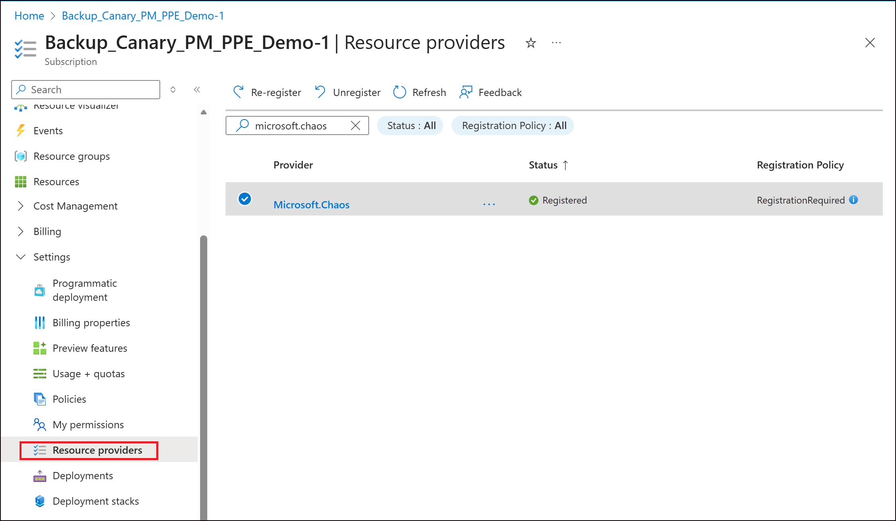

## Drill Setup

To define a Zone Down simulation drill, follow the steps below:

1. Visit the Service Group for which you want to define a Drill and navigate to Resiliency > Drills.

    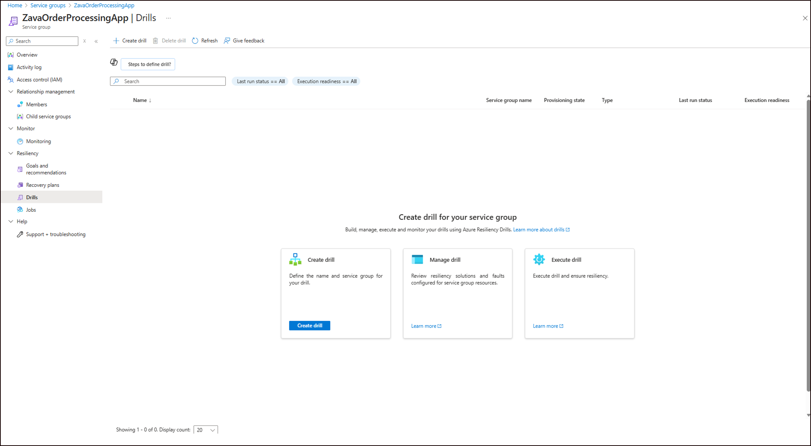

2. Click on **Create drill** and input a suitable name for the Drill instance. Post this, select the Subscription and Region that needs to be associated with the Chaos Experiment that will be created to perform fault injection during the course of the drill. This Subscription and Region need not be related to the Subscriptions and Regions associated with Service Group members.

    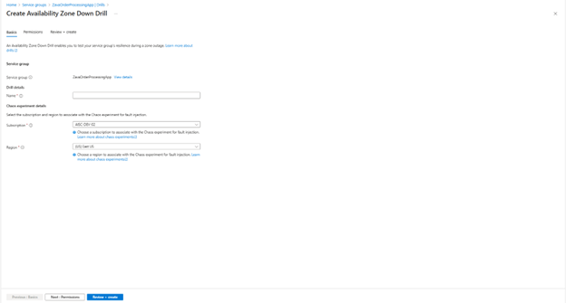

3. Then choose between System-assigned and User-assigned identity that will be used to fetch resources of the Service Group and the associated Azure Health Model details securely. The same identity can be used for fault injection by default or alternately, a different identity can be selected. The role assignment type will use Azure built-in roles by default.

    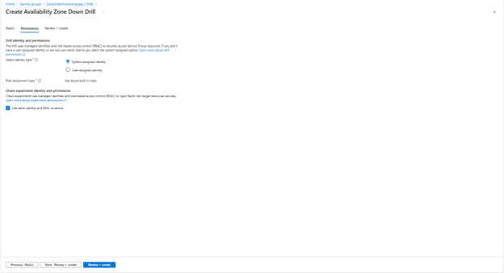

4. Ensure that users responsible for drill creation and execution have the required permissions. These permissions are listed below for quick reference:
    - Minimum role required at Service Group level for successful drill execution: 
        - **SG Drill Contributor**, to Create/Update/Execute Drills (tenant-level resources).  
        - **Recovery Plan Contributor**, to Create/Execute Recovery Plan
    - Minimum role required at Subscription level (the subscription associated with Automation Account and Chaos experiment) for successful drill execution: **Drill Assets Contributor**, to manage the Subscription associated with Automation Account and Chaos experiment.
    - Minimum roles required in individual resources to perform fault injection: **Drill Resource Fault Contributor**, tomanage the target resources.

5. Upon confirmation, the Drill instance gets created. Note that every Service Group can be associated with a single Drill instance. 

6. Upon creation, review the summary widgets on the Overview page that explain the Drill parameters that need fixing in order to proceed with execution of the Drill. For instance, the screenshot below explains that the Azure Health Model associated with the Service Group has issues and is not usable. Similarly, double-click details and edits on Identity and Permissions can be done using the dedicated blade on the left navigation.

    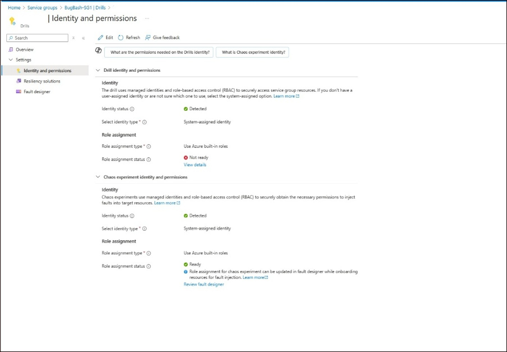

7. Next, proceed to review the resources that are included in the Drill. Key points on the resources included in a drill: 
    1. Resources of the Service Group that have a native zonal resiliency solution are included in the drill by default. These are resources that will qualify for fault injection. 
    2. If the Service Group has resources such as Virtual Machines configured with Azure Site Recovery that require manual failover, a Recovery Plan needs to be associated with the Service Group to failover the resources in the desired order of recovery post fault injection.
    3. The reason why a resource is excluded from the drill can be varied. Some of the common reasons include the lack of a native zonal resiliency solution, resource excluded from recovery plan, the service does not support the detection of zonal resiliency solution for this resource type etc.
    4. Any resource that is excluded by default from the drill can be included back by clicking on “View details and include resources” as shown below. Ensure that you click on “Refresh” upon including resources back to the drill to see the updated list:

    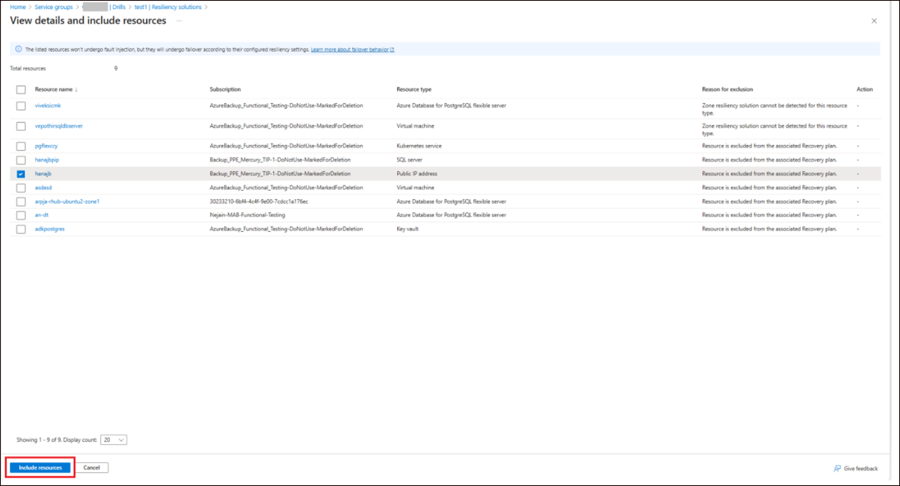

8. Upon confirming the list of resources to be included in the drill, proceed to the Fault Designer tab to review the faults that need to be applied to the resources. Select any resource and click on "Edit fault" for the same. 

    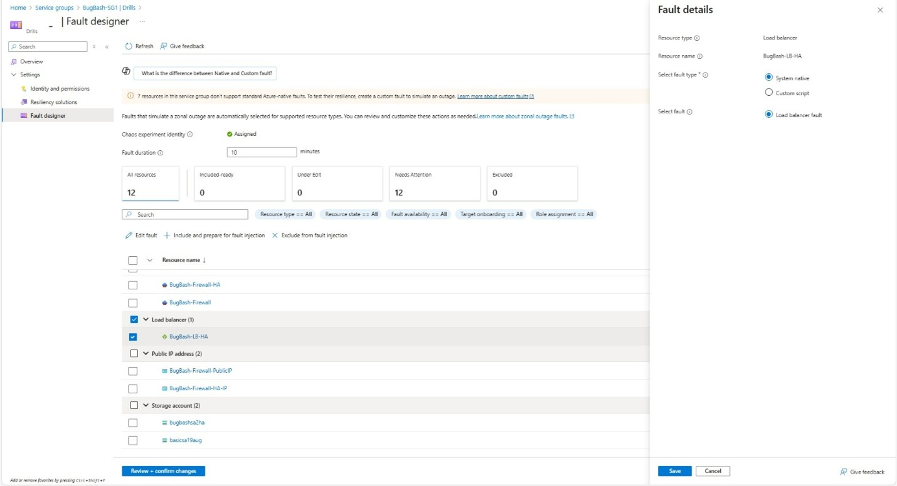

    Supported native zone down faults include:    
    - **Virtual Machine** - Shuts down the virtual machine
    - **Virtual Machine Scale Sets** - Shuts down all VMs in the scale set within a single zone
    - **Azure Kubernetes Service** - Shuts down node pools in a single zone
    - **Azure Database for PostgreSQL flexible servers** - Triggers a forced failover to switch the server’s active zone.
    - **Azure Database for MySQL flexible servers** - Triggers a forced failover to switch the server’s active zone
    - **Azure SQL Database -** Triggers a forced failover to switch the server’s active zone
    - **Azure Load Balancer** - Disables readiness probes in the selected zone using admin override
    - **Azure Cache for Redis** - Restarts the primary node of the cache
    - **App Service** - Stops App Service instances in a single zone.
        
    > [!TIP]
        > For unsupported resource types, use custom scripts powered by Azure Runbooks to define fault logic. Ensure scripts include the following parameters:
        >
        > - `ResourceIds` (string): Comma-separated list of Azure Resource IDs.
        >
        > - `Duration` (int): Duration in minutes.
        >
        > - `TargetZone` (string): Target zone (e.g., az1, az2, az3).

    The current implementation of custom scripts infra do not support individual resource level response schema (i.e. if the script fails, we cannot detect which resources within it failed). Only if custom Scripts adhere to this response schema, will the service be able to get resource level failure details. Otherwise, all resources acted on by this script will be marked as failed if the script fails:

    ````json
    {
      "Status": "Failed",
      "ResourceResults": [
        {
          "IsSuccess": false,
          "Error": {
            "IsRetryable": false,
            "Details": "Please provide a valid tenant or a valid subscription.",
            "Message": "Please provide a valid tenant or a valid subscription.",
            "ErrorCode": "FailedToFaultResource",
            "Category": "Failed"
          },
          "ProcessedAt": "2025-11-04T16:22:25.7161798Z",
          "Metadata": {
            "Status": "Failed"
          },
          "ProcessingDurationMs": 6833,
          "ResourceId": "/subscriptions/00000000-0000-0000-0000-000000000000/resourceGroups/drillTest/providers/Microsoft.DBforPostgreSQL/flexibleServers/test"
        }
      ],
      "SuccessCount": 0,
      "FailureCount": 1,
      "ExecutionStartTime": "2025-11-04T16:22:11.8569539Z",
      "ExecutionEndTime": "2025-11-04T16:22:25.7368318Z",
      "GlobalError": "All PostgreSQL failover operations failed."
    }
    ````

    Note that faults can be applied in bulk for a given resource type by selecting the resource type and clicking on "Edit fault".

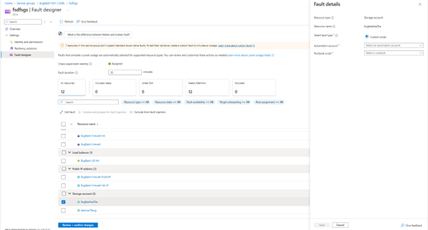

Note that all resources are in "Needs Attention" state by default. Once the fault logic has been defined, select each of these resources and click on "Include and prepare for fault injection". This step proceeds to complete role assignment and target onboarding, which are mandatory steps to perform fault injection. Leverage the hyperlink on "Needs attention" to debug the reason for lack of resource readiness for fault injection.

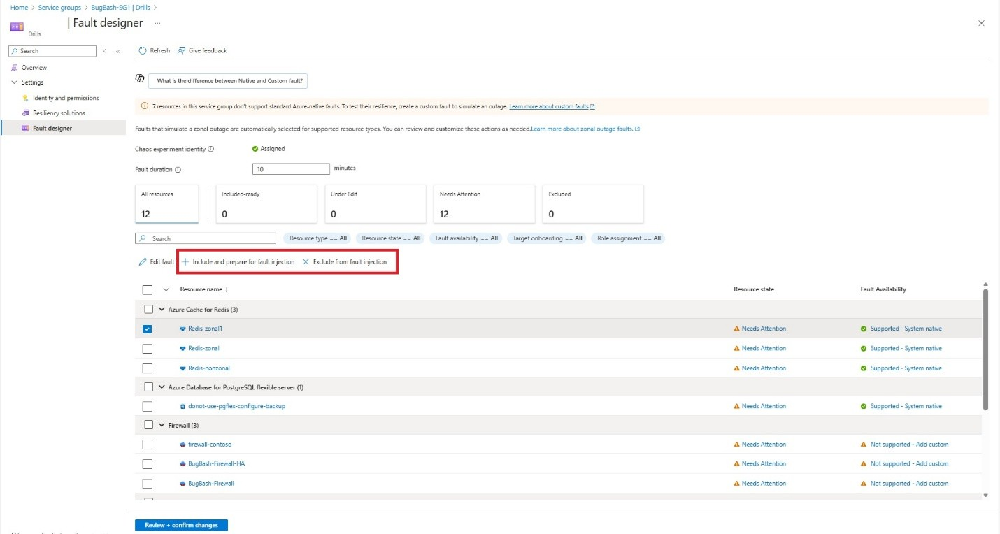

Alternately, resources can be excluded from fault injection by selecting the resource and clicking on "Exclude from fault injection".

Any resource that undergoes changes in the Fault Designer will be in "Under edit" state till the changes are not saved.

Leverage the "Fault duration" input to inject faults for a set duration. The default value is 10 minutes.

9. Once fault design is complete for all resources, review readiness across all summary widgets. "Fix up" on Overview screen can be leveraged to fix any config drifts and to attempt changing "Drill execution readiness" from Not Ready to Ready.

    > [!NOTE]
    > Refresh the drill instance after every edit operation.

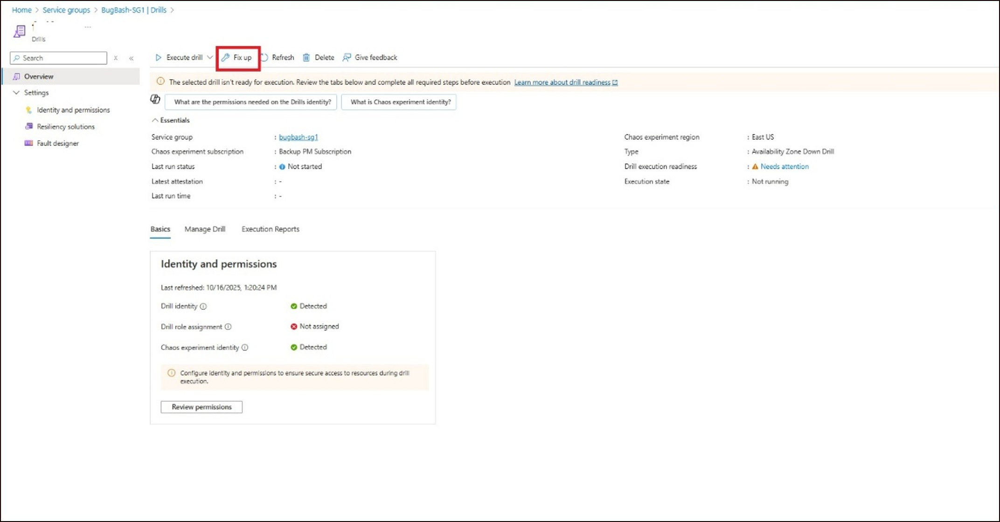

## Drill Execution

1. Once the “Drill execution readiness” is “Ready”, click on “Execute Drill” on the Overview page.

2. Select the Drill execution type. Once fault injection is completed, the Recovery Plan associated with the Service Group gets executed. Ideally, every Service Group should undergo the entire cycle of Fault Injection > Failover > Reprotect > Failover (in reverse direction) > Reprotect (in reverse direction). Depending on which stage your last drill was stopped, you can choose between Failover and Reprotection. 

3. Upon selecting the right operation, review the subset of resources that will undergo the same. For example, if Failover is selected, select the source zone from which the failover should be triggered. This will filter the resources that belong to the selected zone.

4. Finally, review the final set of resources that will undergo fault injection and confirm execution. 

5. Drill execution progress can be tracked through a job as shown below.

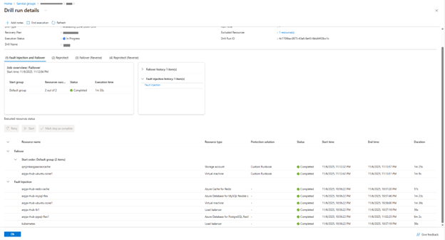
  
Every drill execution job follows the sequence of Fault Injection > Failover > Reprotect > Failover (in reverse direction) > Reprotect (in reverse direction). For a given step, “Retry” operation can be leveraged to re-execute any given operation for a failed resource. “Start” begins the step and “Mark step as complete” ends the step. Once a step, for example, Reprotect is ended, it cannot be retried. 

> [!NOTE]
> For Failover (Reverse) to select the right resources for failover back from target to source zone, edit the source recovery plan’s resources before failover.

Every drill execution also supports addition of notes during the execution which will get stored as a part of run history of the drill. 

> [!NOTE]
> Upon adding notes and saving the notes, refresh the job to update the notes. 

Additionally, every execution run should be explicitly ended using “End execution”, which is followed by review of the notes and an attestation of the final status of the Drill as shown below.

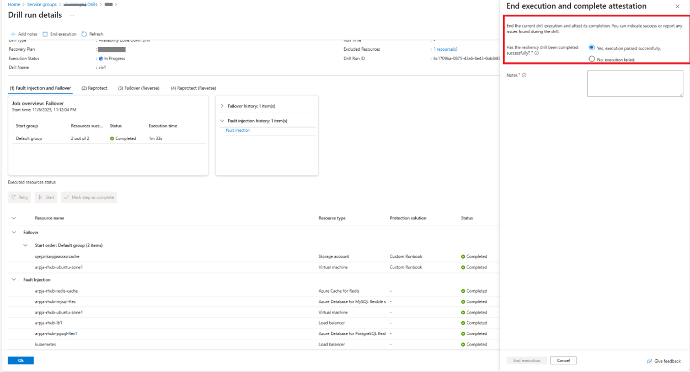