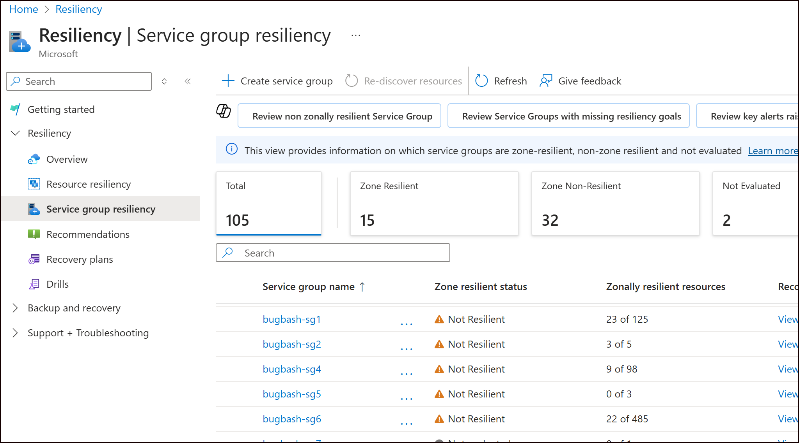
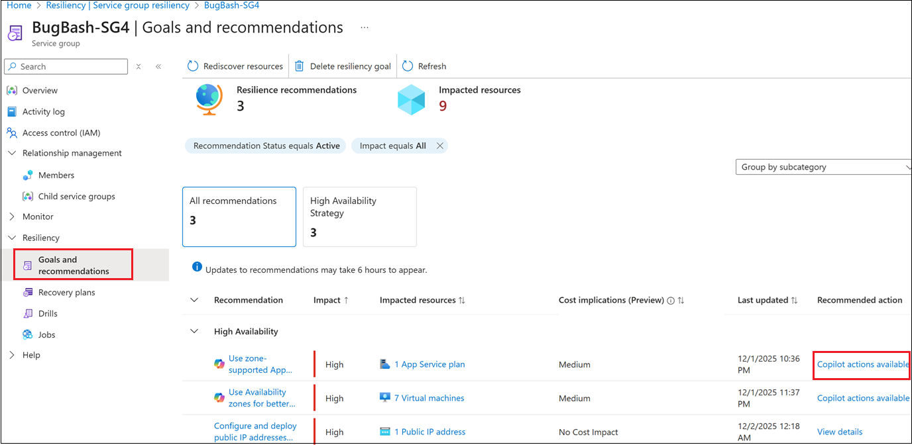
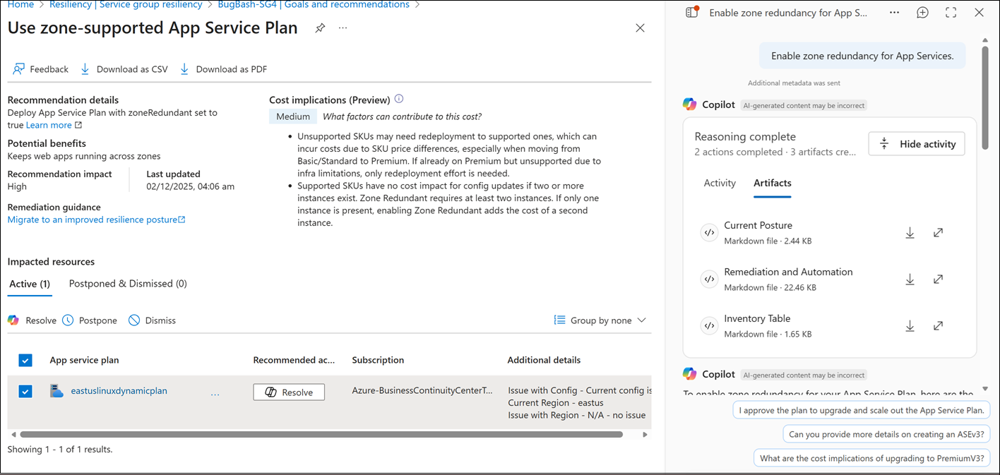
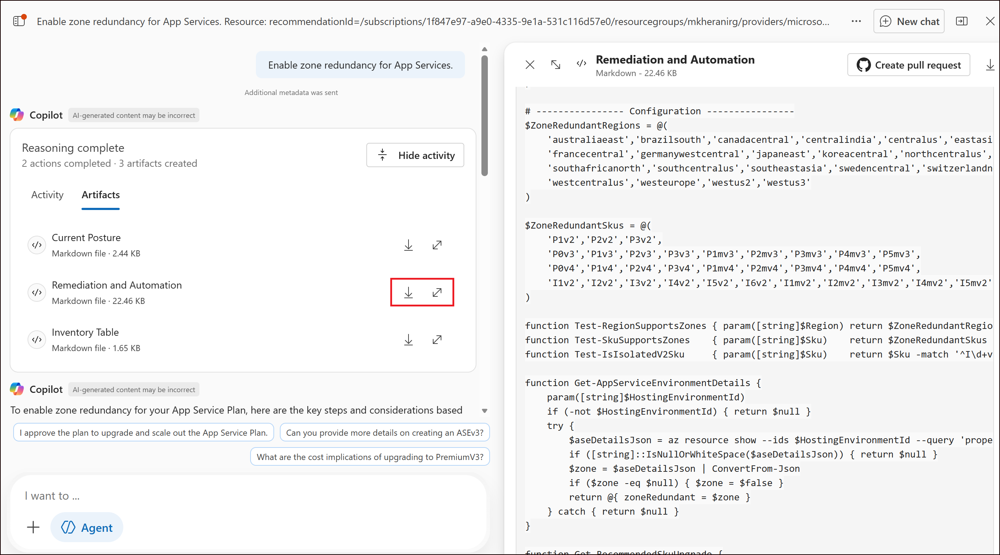

# Get Scripts to Remediate Resources

## Introduction

This tutorial explains how to use Azure Resiliency's Copilot-powered features to discover automation scripts for remediating resources. These scripts help address zonal resiliency recommendations, especially for resources requiring multiple configuration steps. 

> [!NOTE]
> The current experience does not automatically remediate resources. Instead, it provides scripts that you can execute via PowerShell. As this feature is in preview, we recommend testing scripts on non-production resources.

## Prerequisites

Before using the Copilot-powered remediation feature, ensure the following:

1. **Tenant Allowlisting**:
   - Ensure your tenant is allowlisted for Copilot agent mode. This is a separate allowlisting requirement beyond the allowlisting needed for goals, recommendtaions, drills & recovery featues. Contact [azresiliencyprivatepreviewsupport@microsoft.com](mailto:azresiliencyprivatepreviewsupport@microsoft.com) to request allowlisting for agent mode. You will receive a confirmation via email once allowlisted.

2. **Enable Agents (Preview)**:
   - Once the above step is complete, global administrators can enable Agents (Preview) at the tenant level by following these steps:
     1. In the Azure portal, search for **Azure Copilot admin center** and select it.
     2. Under **Settings**, select **Access management**.
     3. In the **Agents (Preview)** section, toggle **Request access to Agents (Preview)** to **On**.
   - Once approved, all users in the tenant with access to Azure Copilot can use the Agents (Preview) features.

3. Ensure that all the other pre-requisites in [this article](../Prerequisites.md) are also met before proceeding.

## Supported Scenarios

The **Resolve using Copilot** feature supports the following resource types:

- Azure VM
- Azure App Services
- Azure PostgreSQL
- Azure MySQL
- Azure SQL Managed Instance
- Azure Firewall
- Azure Redis Cache

> [!IMPORTANT]
> Ensure that scripts are executed only on test resources during the preview phase.

## Accessing Remediation Scripts

Follow these steps to access and use the remediation scripts:

1. **Navigate to the Resiliency Portal**:
   - Search for **Resiliency** in the Azure portal and open the Resiliency portal.

2. **Select a Service Group**:
   - Click **Service Group Resiliency** in the left navigation pane.
   - Select the Service Group for which you want to view recommendations.

    

3. **View Recommendations**:
   - Recommendations with Copilot actions are clearly indicated. Click on a recommendation to view details.

    

4. **Resolve Recommendations**:
   - On the details page, click the **Resolve** button in the second column of the grid.
   - Copilot analyzes the resource's current configuration and generates artifacts.

    

5. **Review Generated Artifacts**:
   - Navigate to the **Artifacts** tab to access the following:
     - **Current Posture**: Details the Zonal Resiliency (ZR) configuration status and reasons for compliance or non-compliance.
     - **Remediation and Automation**: Lists the scripts required for remediation, including pre-steps and post-steps.
     - **Inventory Table**: Provides information on each resource discovered by Copilot, especialply useful for tlarger scopes like Ssubscriptions or Service Groups.

    

## Known Issues

The following issues are known and will be addressed in future updates:

1. **Inline Commands**:
   - Occasionally, auto-generated commands may appear inline in the Copilot chat. Rely only on the content in the artifacts as described above, as those have been more thoroughly tested.

2. **SQL Managed Instance (MI) Eligibility**:
   - For SQL MI resources, the system today does not automatically check for hardware eligibility for ZR conversion. Ensure that the SQL MI is on supported hardware. Other checks, such as VNet zone awareness, backup redundancy, and SQL MI tier, are performed automatically.

## Next Step

[Create a recovery plan for your service grooup](../Recovery%20plan/CreateAndExecuteRecoveryPlan.md)