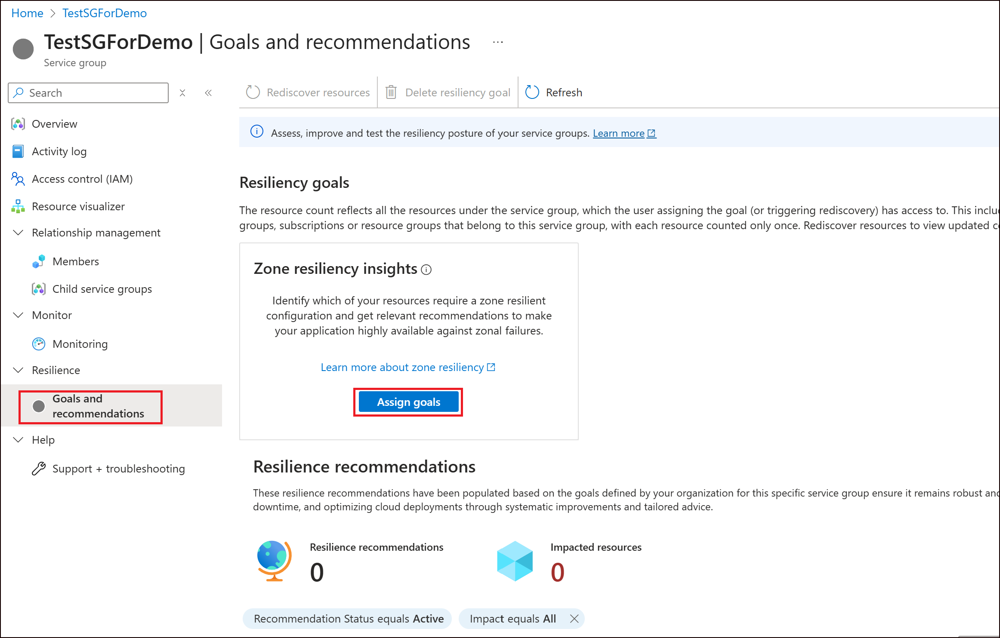
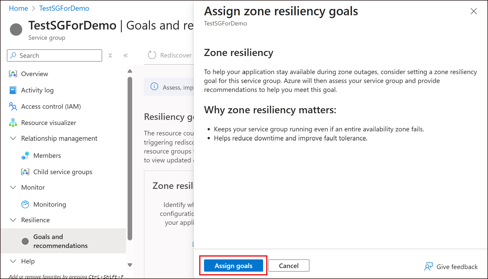

# How to Assign Goals to Your Service Group

To understand your service group's resiliency status and receive tailored recommendations, you must first assign goals. This guide walks you through the prerequisites for assigning goals, supported scenarios, and step-by-step instructions for assigning goals in Resiliency in Azure.

> [!NOTE]
> The current release of Resiliency experiences supports only **zonal resilience** goals. Future updates will include support for **regional resilience** (disaster recovery), **cyber resiliency**, and more.

---

## Prerequisites

- Before assigning goals, make sure you have **Service Group Contributor** (or higher) access to the service group.
- Ensure that all the other pre-requisites in [this article](../Prerequisites.md) are also met before proceeding.

---

## Usage Constraints

There are a few limitations to be aware of:

- Goals **cannot** be assigned to service groups that contain **500 or more resources**.

---

## Assigning Goals

Follow these steps to assign goals to your service group:

1. Navigate to your **Service Group**.
2. Select the **Goals and recommendations** tab.
3. Click the **Assign goals** CTA button.
    
4. A confirmation blade will appear. Click **Save** to confirm.
    
5. The system will begin assigning resources as well as discovering resources in the service group. This may take a few minutes to complete.
6. Once discovery is complete, a **summary of your protection posture** and **recommendations** will be displayed.

> [!TIP]
> The next article will help you interpret the protection summary, manage exclusions, and take action on recommendations.

## Next steps

[View resilience posture for your service group](./ViewResiliencePosture.md)
