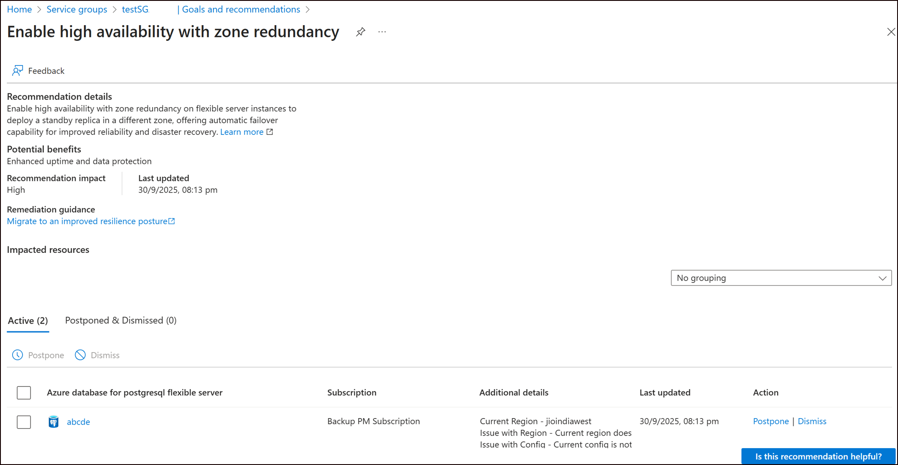

# Review Zone Resiliency Recommendations

## Overview

Resiliency in Azure provides zone redundancy (ZR) recommendations to help improve the availability and resiliency of Azure services. This guide explains how to interpret and act on these recommendations across compute, container, data, and networking resources.

---

## Viewing recommendations

1. **Before goals are set (Day 0):** You will see a single, service-group level recommendation that prompts you to [assign goals](AssignGoals.md). Follow the link to assign goals for the service group.
2. **After goals are assigned:** Resiliency service evaluates supported resources in the service group and surfaces resource-level recommendations for items that do not meet the assigned goals (for example, missing zone resiliency).
    
3. **Inspect and act on recommendations:** Select any recommendation to open the recommendation details page. Details include the impacted resource(s), why the recommendation was raised, and step-by-step remediation guidance you can follow to resolve the issue or mark the resource as exempt or manually attested.
    
4. **[New] Review cost of implementing recommendation**: The new preview feature in Azure Advisor helps improve visibility into potential cost increases by surfacing qualitative cost indicators - High, Medium, or Low - alongside descriptions of the factors that influence costs. For selected recommendations, cost implication labels and explanations clarify whether a change is likely to result in a high, medium or low impact on spending. This enhancement reduces uncertainty and empowers teams to balance reliability, performance, and cost more effectively. [Understand qualitative cost indicators for zone resiliency recommendations](#understanding-qualitative-cost-indicators).
    

> [!NOTE]
>
> - Recommendations are not instantaneous. Service-group level changes (for example, assigning goals) typically take up to 2 hours to update in the portal.
> - Resource-level recommendation status changes — for example, after you implement a zone-resiliency configuration — typically take up to 2 hours to refresh.
> - Newly added resources can take longer to appear in recommendations. Depending on the refresh cadence for that resource type, it may take between 6–24 hours for recommendations to be generated.

## Understanding qualitative cost indicators

Each supported recommendation includes a Cost Implication label and a description of factors that may affect your costs. The estimates are qualitative and actual cost increase may vary based on your Microsoft agreement, subscription type, and usage patterns. 

| Label | Estimated Cost Increase | Explanation | 
|-------|-------------------------|-------------|
| High | More than 100% | Significant cost increase expected |
| Medium | 30% - 100% | Moderate cost increase expected.| 
| Low    | Up to 30%  | Minimal cost impact expected.  |
| No cost impact  | 0%  | No change to current costs. |

Factors that may affect costs include changes in resource configuration, infrastructure requirements, or data transfer patterns. In certain scenarios, the cost impact of a recommendation varies significantly due to factors such as SKU availability within a region, capacity constraints, and desired resiliency level. In these cases, the cost implication label may be presented as a range (for example, Medium–High), indicating that the actual cost impact depends on multiple variables specific to your environment. 

## Recommendation reference

This reference describes each recommendation by resource type, explains the evaluation logic that surfaces the recommendation, and identifies the expected impact — including whether applying the recommendation requires redeployment or planned downtime. Use these details to plan remediation steps and schedule any required maintenance windows.

For step-by-step implementation guidance, see the [Resource type implementation guides](./ResourceTypes). Each guide contains configuration instructions, deployment examples, and implementation notes to help you apply zone resiliency to that specific resource type.

### Compute Resources

#### Virtual Machines

- **Recommendation**: Use Availability zones for better resiliency and availability
- **Evaluation Logic**:
  - Checks zone alignment of VM, public IPs, and attached disks.
- **Redeployment/Downtime**: Yes, in most cases.

#### Virtual Machine Scale Sets (VMSS)

- **Recommendation**: Configure and deploy Azure Virtual Machine Scale Sets in a more resilient and balanced configuration.
- **Evaluation Logic**:
  - Checks zone distribution and SKU capacity.
- **Redeployment/Downtime**: Yes

### Container Resources

#### Azure Kubernetes Service (AKS)

- **Recommendation**: Configure and deploy Azure Kubernetes Service (AKS) and related resources to use availability zones.
- **Evaluation Logic**:
  - Checks agent pool distribution across zones.
- **Redeployment/Downtime**: Yes

### Data Services

#### Azure SQL Database

- **Recommendation**: Enable zone redundancy for Azure SQL Database to achieve high availability and resiliency
- **Evaluation Logic**:
  - Checks zone redundancy property
- **Redeployment/Downtime**: Brief disconnect

#### Azure SQL Managed Instance

- **Recommendation**: Enable zone redundancy for Azure SQL Managed Instance to improve high availability and resiliency
- **Evaluation Logic**:
  - Checks zone redundancy property
- **Redeployment/Downtime**: Brief disconnect

#### PostgreSQL Flexible Server

- **Recommendation**: Enable HA with zone redundancy.
- **Evaluation Logic**:
  - Checks HA mode property
- **Redeployment/Downtime**: Yes

### Storage and Networking

#### Storage Account

- **Recommendation**: Enable zone redundancy for storage accounts to improve high availability and resiliency
- **Evaluation Logic**:
  - Checks for ZRS configuration
- **Redeployment/Downtime**: Yes in some cases

#### Azure Firewall

- **Recommendation**: Deploy Azure Firewall across multiple availability zones
- **Evaluation Logic**:
  - Checks AZ deployment.
- **Redeployment/Downtime**: Yes

## Next steps

[Review summary of resilience posture at-scale across your Azure estate](../At%20Scale/ResiliencyOverview.md)