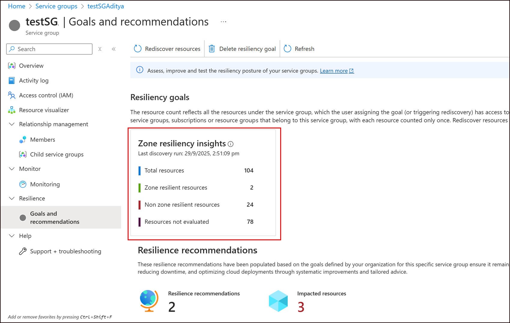
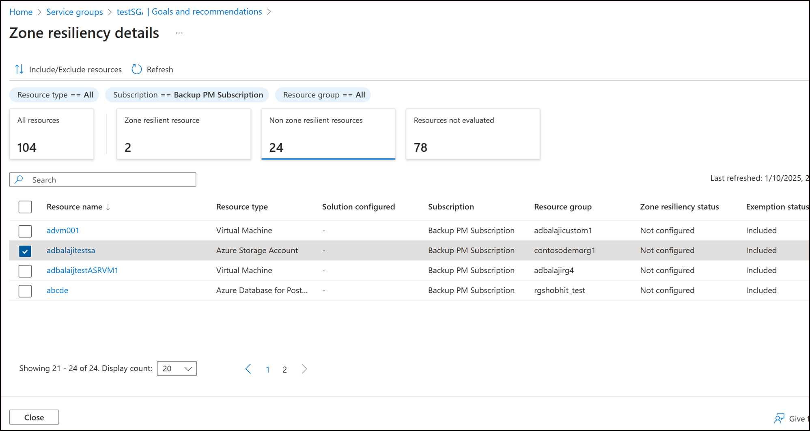
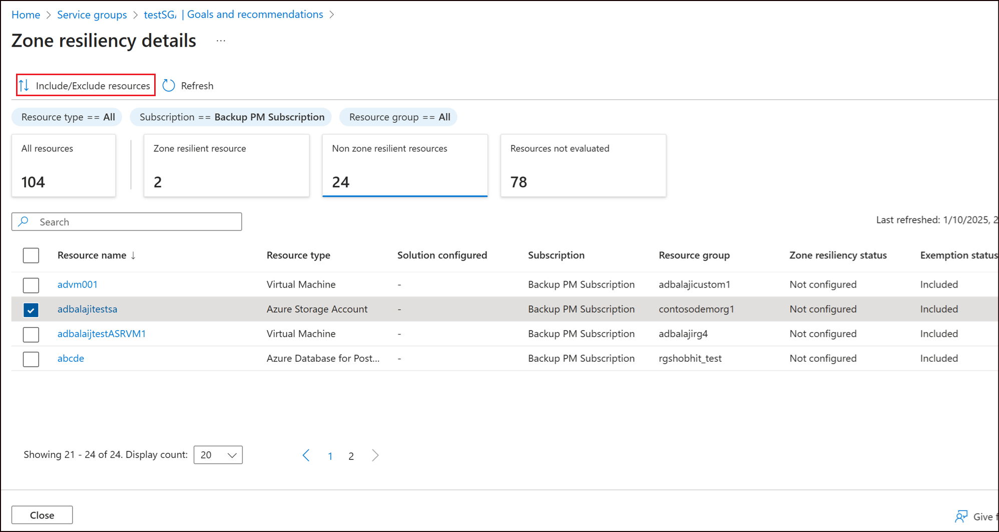
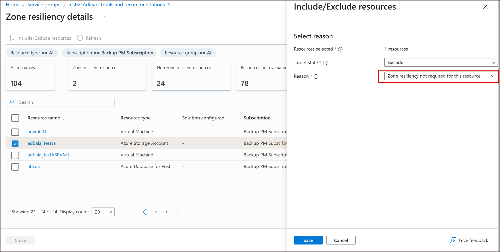
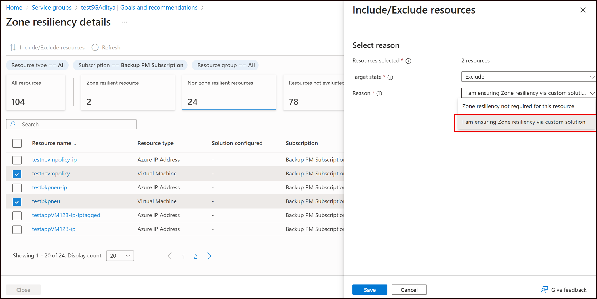
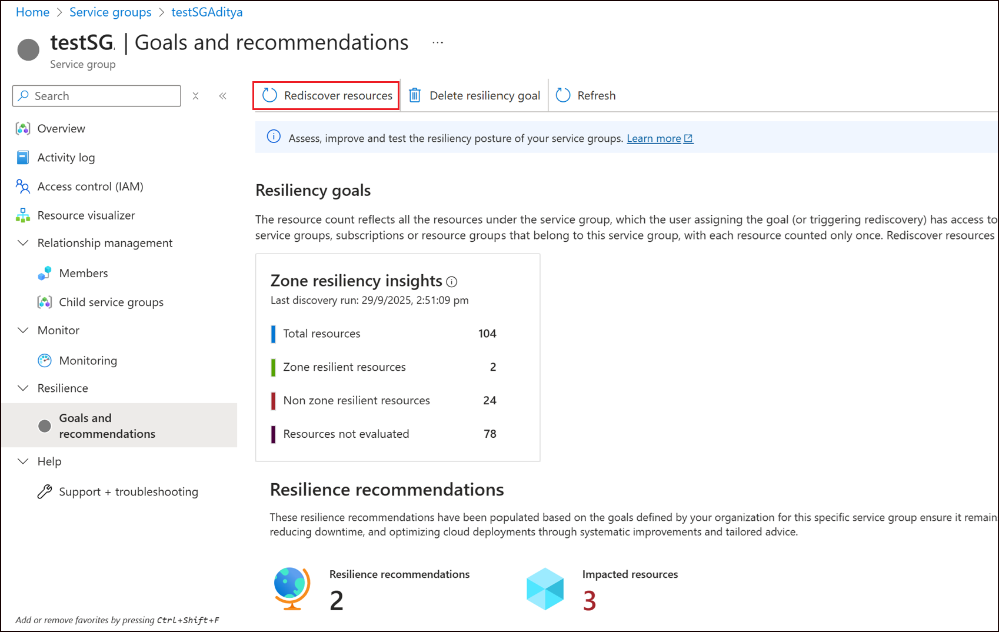

# How to view the Resiliency Posture of your Service Group

This article explains how to interpret the **resiliency summary view** of your service group in Resiliency experiences. It covers key concepts, supported scenarios, and how to **exclude or manually attest resources** to improve the accuracy of your resilience posture and receive more targeted recommendations.

---

## Key Concepts

Once goals are assigned to your service group, the resilience summary displays three key metrics:

1. **Zone-resilient resources**  
   Resources configured with an Azure-recommended solution for zone resiliency. You may also manually attest resources using custom solutions not currently detectable by Resiliency service.

2. **Non Zone-resilient resources**  
   Resources for which no zone resiliency solution has been detected.

3. **Resources not evaluated**  
   Resources excluded from evaluation by the user, or unsupported by Resiliency service.

The resource count reflects all the resources under the service group, which the user assigning the goal (or triggering rediscovery) has access to. This includes **resources under any child service groups**, **subscriptions** or **resource groups** that belong to this service group, with each resource counted only once.

> [!NOTE]
>
> - You need **Service Group Reader** permissions to view the zonal resilience summary. You also need Reader access to the **resources** for which zone resiliency status needs to be viewed.
> - Newly added resources are **not automatically refreshed** post goal assignment. [Re-discovery](#rediscovering-resources) is required to include them. This limitation will be addressed in future updates.

---

## Viewing resiliency posture

To view the resiliency posture for your service group:

1. Navigate to your service group in the portal and select **Goals and Recommendations** from the menu under the Resilience section.
2. If goals have been assigned, a summary view appears showing the distribution of resources based on their zone-resiliency configuration status.
    
3. Select the summary tile to view a detailed list of resources in the service group. This includes:
    - The zonal resiliency solution configured for each resource.
    - Whether each resource is included or excluded from goal evaluation.
    

> [!NOTE]
>
> - By default, all supported resource types are included in the goal evaluation.
> - There might be a temporary discrepancy between the number of recommendations shown and the number of non-zonally resilient resources. This is because the recommendations take a few hours to get updated. Use the summary tile to get the latest resilience posture of the service group.

## Override Resiliency Assessment in Specific Scenarios

In some cases, you may need to override the default resiliency assessment provided by Resiliency service. This can help ensure that recommendations align with your architectural decisions and operational context.

### Scenario 1: Exclude Non-Critical Resources

You can choose to exclude resources that are not critical to your workload’s availability.
**Example:**
Storage accounts used solely for telemetry logging may not require zone-resiliency and can be excluded from evaluation.

To exclude a non-critical resource, follow the below steps:

1. Navigate to the Resiliency Summary tile and open the resource list view.
2. Choose the resource you want to exclude and click on **Include/Exclude Resources**.
    
3. Set the Target State to **Excluded**. In the Reason field, choose "Zone resiliency not required for this resource".
    
4. Once saved, the exemption status for the resource shows up as 'Excluded' and is counted under the 'Not Evaluated' category.

> [!NOTE]
> Resource types that are not supported by Resiliency service are automatically excluded from goal evaluation and cannot be included. However, if you are already ensuring resiliency for these resources, you can manually attest them to reflect their resiliency status in the summary view.

### Scenario 2: Manually Attest Resources

Some resources may be resilient by design, even if Azure cannot automatically detect their configuration.
**Example:**
Single-instance virtual machines (VMs) deployed across multiple zones, where resiliency is managed at the application level. In such cases, you can manually mark these VMs as compliant to prevent them from being flagged in recommendations.

To manually attest a resource, follow the below steps:

1. Navigate to the Resiliency Summary tile in the service group and open the resource list view.
2. Choose the resource you want to exclude and click on **Include/Exclude Resources**.
3. Set the Target State to **Excluded**. In the Reason field, choose "Ensuring zone resilience via custom solution".
    
4. Once saved, the exemption status for the resource shows up as 'Manually attested' and is counted under the 'Zone resilient' category.

## Rediscovering resources

Over time, there might be changes to your service group, such as resources being added or deleted. To ensure that your resiliency posture view reflects the latest state of the service group, you can trigger the 'Re-discover resources' action to ensure that new resources are also evaluated for their zone resiliency status.

   

> [!IMPORTANT]
>
> - To rediscover resources, you must have Service Group Contributor permissions., as well as Service Group membership read access to the resources that get rediscovered.
> - Rediscovery evaluates only the resources accessible to the user who starts the action. Different users with different access can produce different rediscovery results.
>
> Example:
>
> - If User 1 has service group membership read access to resources A, B, and C and runs rediscovery, Resiliency service will consider A, B, and C as part of the service group for evaluation.
> - If User 2 later runs rediscovery and has access only to resources B and C, Resiliency service will evaluate only B and C as part of the service group for evaluation.
>
> Recommendation:
>
> - Limit who can run rediscovery and ensure those users have access to the full set of service-group resources. This helps keep rediscovery results consistent and complete.

## Supported Solutions

The following table lists the Azure-supported solutions recognised by Resiliency service for each resource type:

| **Resource Type**       | **Detected Solution**                                  |
|-------------------------|--------------------------------------------------------|
| Azure VM                | Azure Site Recovery with zonal disaster recovery (or) Manual attestation     |
| Azure SQL DB            | Azure SQL DB Zone-redundancy                               |
| Azure SQL MI            | Azure SQL MI Zone-redundancy|
| Azure Cosmos DB         | Azure Cosmos DB Zone-redundancy |
| Azure Database for PostgreSQL - Flexible Server         | Azure PostgreSQL Zone-redundancy |
| Azure Storage Account   | Zone-redundant storage / Geo-zone-redundant storage / Read-access geo-zone-redundant storage |
| Azure Service Bus         | Azure Service Bus Zone-redundancy |
| Azure Kubernetes Services         | Azure Kubernetes Services Zone-redundancy |
| Azure Container Registry         | Azure Container Registry Zone-redundancy |
| Azure Load Balancer         | Azure Load Balancer Zone-redundancy |
| Azure Application Gateway         | Azure App Gateway Zone-redundancy |
| Azure Firewall         | Azure Firewall Zone-redundancy |
| Azure IP Address         | Azure IP Address Standard SKU Zone-redundancy |

## Next steps

[Review recommendations for your service group](./Recommendations.md)