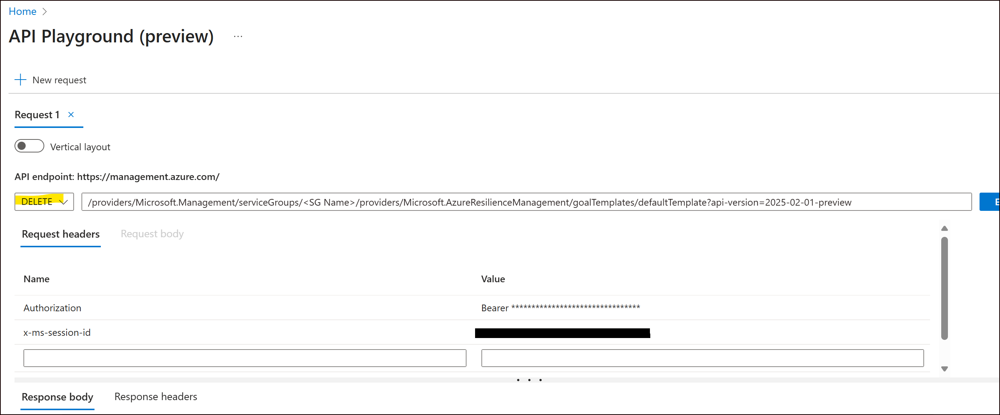

# Troubleshoot Errors in Resiliency Center

This article contains information about common errors you might encounter while using Resiliency Center.

> [!NOTE]
> This content will be updated throughout the preview period. If you encounter errors not covered here, contact [azresiliencyprivatepreviewsupport@microsoft.com](mailto:azresiliencyprivatepreviewsupport@microsoft.com) with the information listed in [Report an issue](#report-an-issue).

## Report an issue

If you encounter an issue while using Resiliency Center, send an email to [azresiliencyprivatepreviewsupport@microsoft.com](mailto:azresiliencyprivatepreviewsupport@microsoft.com) with the following information. Providing both basic details and troubleshooting details helps the product team investigate the issue and improve the product.

### Basic information

Include the following details in your report:

- **Browser URL**: Copy and paste the URL from your browser when the issue occurs
- **Screenshot**: If there's a page crash or UX error, include a full browser window screenshot
- **Date and time**: Approximate date and time when the issue occurred
- **Issue description**: Detailed description of the issue and reproduction steps (if available)

### Troubleshooting information

If you can reproduce the issue, collect the following diagnostic information:

1. **Network trace**:
   - Open browser Developer Tools (F12)
   - Enable Network trace
   - Reproduce the scenario
   - Export the network trace as a .har file
   - Rename the file as `<CaseNumber>_networktrace.har`

2. **Console logs**:
   - In Developer Tools (F12), go to the **Console** tab
   - Copy and paste all console content
   - Save the content as `<CaseNumber>_consolelogs.txt`

3. **Send both files**: Include both the .har file and console logs in your email.

## Common Errors

### Goal assignment errors

#### Goal assignment fails with "Goal template does not exist" error

**Error message:**

```text
Goal template does not exist
```

**Cause:** This issue occurs when the `Microsoft.AzureResilienceManagement` resource provider isn't registered on your tenant. For more information about prerequisites, see [Prerequisites](./Prerequisites.md).

**Resolution:**

Follow these steps to register the resource provider and resolve the issue:

1. **Register the resource provider:**

   Run the following PowerShell commands to register the resource provider on your tenant:

   ```powershell
   Connect-AzAccount
   # Login when prompted. If prompted for a subscription ID, use any subscription within your tenant
   
   Invoke-AzRestMethod -Path /providers/Microsoft.AzureResilienceManagement/register?api-version=2021-04-01 -Method POST
   # Check for successful registration (status code 200)
   ```

2. **Delete the existing goal template:**

   After successful registration, delete the existing goal template using the Azure Resource Manager API Playground:

   a. Open the [Azure Resource Manager API Playground](https://portal.azure.com/#view/Microsoft_Azure_Resources/ArmPlayground) in the Azure portal.

   b. Run the following DELETE command (replace `<SG Name>` with your service group name):

   ```http
   DELETE /providers/Microsoft.Management/serviceGroups/<SG Name>/providers/Microsoft.AzureResilienceManagement/goalTemplates/defaultTemplate?api-version=2025-02-01-preview
   ```

3. **Retry goal assignment:**

   After successful deletion, try to assign goals to the service group again. Please wait a few minutes after tenant registration before attempting to assign goals.



#### Resource count exceeds maximum limit during goal assignment

**Error message:**

```text
Resource count in the service group exceeds the maximum supported limit of 500
```

**Cause:** This error occurs when you try to assign goals to a service group that contains 500 or more resources, which exceeds the supported scope of Resiliency Center.

**Resolution:**

Remove non-essential memberships from the service group.
    1. Navigate to the service group and select the **Members** tab.
    2. Remove the memberships you don't need.
    3. Try to assign goals again.

> [!IMPORTANT]
> The resource count includes all resources under the service group, including any child service groups, subscriptions, or resource groups. Each resource is counted only once.

### Rediscovery errors

#### Resource count exceeds maximum limit during rediscovery

**Error message:**

```text
Resource count in the service group exceeds the maximum supported limit of 500. All existing goal assignment resource associations have been cleaned up.
```

**Cause:** This error occurs when resources are added to the service group (or any child service groups, subscriptions, or resource groups) after goal assignment, causing the number of discovered members to exceed 500. This exceeds the supported scope for Resiliency Center.

**Resolution:**

Remove non-essential memberships from the service group.
    1. Navigate to the service group and select the **Members** tab.
    2. Remove the memberships you don't need.
    3. Trigger [rediscovery](./Goals%20and%20recommendations/ViewResiliencePosture.md#Rediscovering-resources) again.

The error should resolve if the new resource count is less than 500.
